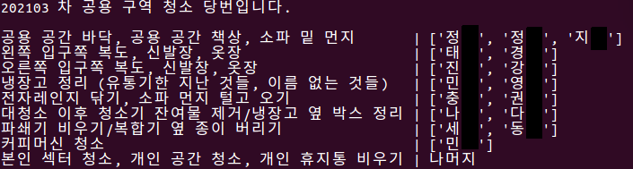

# CVLab Cleaning Assignment

## Requirements

- Python 3.7

## Prerequisites
``seats.csv`` is provided on request.

## Important argument

``date`` is a random seed for assignment. Use a form of ``YYYYMM`` (ex. 202103).

## Command line

    python run.py -date 202103

## Output

